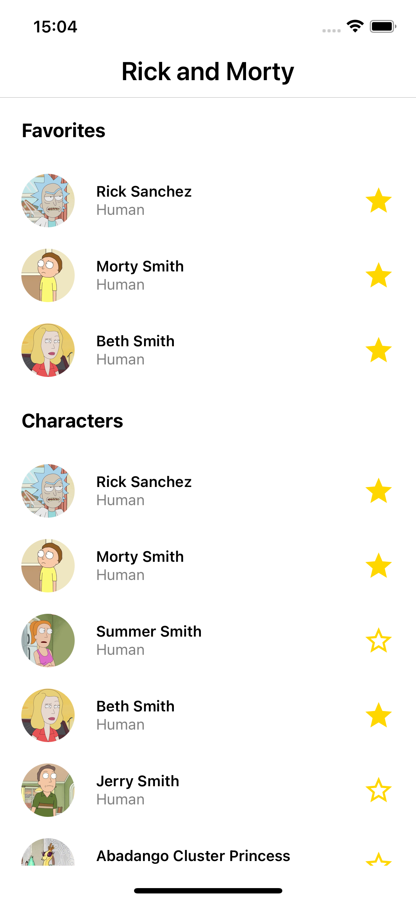

# Rick and Morty - React Native App

<div style="background-color: red; display: flex; flex-wrap: no-wrap;">
    
    
</div>

## Tecnologias usadas

- React Native
- Expo
- Styled Components
- Jest
- Apollo (Graphql)
- React Native Reanimated
- Typescript

## Escolhas Técnicas

### Padrões

Para melhorar a manutenção do código foi adotado o Atomic Design como metodologia principal. Esta abordagem estrutural permite organizar os componentes de forma modular e escalável e, ainda, facilita a compreensão e manutenção do sistema ao longo do tempo.

Além disso, foram criados templates reutilizáveis que podem ser aplicados em diversas telas. Esses templates são projetados para agilizar o desenvolvimento de novas interfaces e promover consistência visual e funcional em todo o aplicativo. Isso não apenas acelera o processo de desenvolvimento mas também mantém um padrão de design coeso em diferentes partes da aplicação.

## Telas

### Início



### Detalhes


### Animação

<div style="background-color: red; display: flex; flex-wrap: no-wrap;max-height: 600px;">
    
    
</div>

## Configuração

```shell
git clone https://github.com/rogertavaress/rick-and-morty-rn.git
cd rick-and-morty-rn
yarn
```

## Execução

```shell
yarn ios
```

## Testes

### Testes Unitários

```shell
yarn test
```

| File                                  | % Stmts | % Branch | % Funcs | % Lines | Uncovered Line #s |
| ------------------------------------- | ------- | -------- | ------- | ------- | ----------------- |
| All files                             | 98.11   | 90.9     | 96.15   | 98.11   |
| components/Atoms                      | 0       | 0        | 0       | 0       |
| index.ts                              | 0       | 0        | 0       | 0       |
| components/Atoms/BannerImage          | 100     | 100      | 100     | 100     |
| index.tsx                             | 100     | 100      | 100     | 100     |
| components/Atoms/Loading              | 100     | 100      | 100     | 100     |
| index.tsx                             | 100     | 100      | 100     | 100     |
| components/Atoms/ProfileImage         | 100     | 100      | 100     | 100     |
| index.tsx                             | 100     | 100      | 100     | 100     |
| components/Atoms/SectionInfo          | 100     | 100      | 100     | 100     |
| SectionInfo.styles.ts                 | 100     | 100      | 100     | 100     |
| index.tsx                             | 100     | 100      | 100     | 100     |
| components/Atoms/SectionInfoContainer | 100     | 100      | 100     | 100     |
| index.ts                              | 100     | 100      | 100     | 100     |
| components/Atoms/SectionItemButton    | 100     | 100      | 100     | 100     |
| SectionItemButton.styles.ts           | 100     | 100      | 100     | 100     |
| index.tsx                             | 100     | 100      | 100     | 100     |
| components/Atoms/SectionTitle         | 100     | 100      | 100     | 100     |
| SectionTitle.styles.ts                | 100     | 100      | 100     | 100     |
| index.tsx                             | 100     | 100      | 100     | 100     |
| components/Atoms/StarIcon             | 100     | 100      | 100     | 100     |
| index.tsx                             | 100     | 100      | 100     | 100     |
| components/Molecules                  | 0       | 0        | 0       | 0       |
| index.ts                              | 0       | 0        | 0       | 0       |
| components/Molecules/FavoriteButton   | 100     | 100      | 100     | 100     |
| index.tsx                             | 100     | 100      | 100     | 100     |
| components/Organisms                  | 0       | 0        | 0       | 0       |
| index.ts                              | 0       | 0        | 0       | 0       |
| components/Organisms/AnimatedItem     | 100     | 0        | 100     | 100     |
| index.tsx                             | 100     | 0        | 100     | 100     | 14                |
| components/Organisms/InfoItem         | 100     | 100      | 100     | 100     |
| InfoItem.styles.ts                    | 100     | 100      | 100     | 100     |
| index.tsx                             | 100     | 100      | 100     | 100     |
| components/Organisms/SectionItem      | 100     | 100      | 100     | 100     |
| index.tsx                             | 100     | 100      | 100     | 100     |
| templates/Info                        | 100     | 100      | 100     | 100     |
| Info.styles.ts                        | 100     | 100      | 100     | 100     |
| index.tsx                             | 100     | 100      | 100     | 100     |
| templates/List                        | 88.88   | 100      | 85.71   | 88.88   |
| List.styles.ts                        | 100     | 100      | 100     | 100     |
| index.tsx                             | 87.5    | 100      | 85.71   | 87.5    | 36                |
